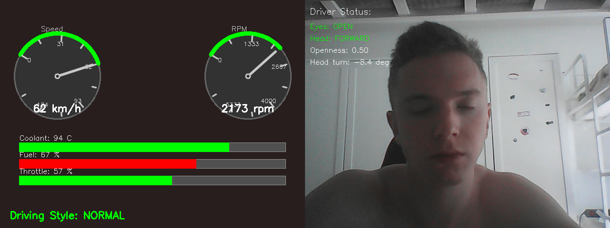

# Real Car ADAS Monitor

Система мониторинга автомобиля в реальном времени, разработанная на C++ в рамках курса «Программная инженерия».

##  Описание

Система мониторинга автомобиля в реальном времени объединяет:
- Анализ телеметрии OBD-II (скорость, обороты, температура, уровень топлива и др.) из CSV-файла.
- Классификацию стиля вождения (SLOW / NORMAL / AGGRESSIVE) с помощью нейронной сети, экспортированной в ONNX.
- Мониторинг состояния водителя через веб-камеру:
  - детекция лица и глаз,
  - оценка открытости глаз и поворота головы,
  - формирование предупреждений об усталости (длительное закрытие глаз) и отвлечении (поворот головы).
- Графическую приборную панель (спидометр, тахометр, линейные шкалы температуры, топлива, дросселя, индикатор стиля вождения).
- Отображение видео с камеры и DMS-информации на правой половине экрана.
- Запись итогового видео (1280×480) в файл и логирование предупреждений.
- Многопоточную архитектуру: отдельный поток для чтения OBD-данных и классификации, главный поток – для камеры, отрисовки и взаимодействия с пользователем.


## Стек технологий

| Компонент            | Технология                                   |
|----------------------|----------------------------------------------|
| Язык программирования | C++17                                        |
| Сборка               | CMake (3.20+), Visual Studio 2022 (MSVC)    |
| Компьютерное зрение  | OpenCV 4.x (DNN для детекции лиц, Haar каскады для глаз) |
| Инференс нейросети   | ONNX Runtime 1.18.0                         |
| Тестирование         | Google Test 1.14.0                          |
| Документирование     | Doxygen                                      |
| Система контроля версий | Git, GitHub                               |
| Обучение нейросети   | PyTorch, Google Colab                       |

##  Сборка
1. **Установите необходимое ПО:**
   - Visual Studio 2022 (Build Tools или Community) с компонентами C++.
   - CMake (≥3.20) – добавьте в PATH.
   - Git (опционально).
   - Python 3.10+ (если потребуется генерировать данные).

2. **Склонируйте репозиторий:**
   ```bash
   git clone https://github.com/ICHpoken/real-car-adas-monitor.git
   cd real-car-adas-monitor

3. **Настройте пути в CMakeLists.txt (при необходимости):**
 - OpenCV: set(OpenCV_DIR "C:/opencv/build/x64/vc16/lib") 
 - ONNX Runtime: set(ONNXRUNTIME_ROOT "C:/onnxruntime")

4. **Соберите проект (из командной строки):**
mkdir build
cd build
cmake .. -G "Visual Studio 17 2022" -A x64
cmake --build . --config Release

## Запуск
1. Убедитесь, что DLL-библиотеки (opencv_world4xxx.dll, onnxruntime.dll) скопированы в папку build/Release
2. Запустите приложение:
  cd build/Release
  RealCarMonitor.exe
3. Управление:
  Q – выход
  SPACE – пауза/возобновление
  S – сохранить скриншот в output/screenshot.png
4. Результаты работы сохраняются в папку output:
  result_situation2.mp4 – видео работы системы.
  dms_alerts.log – лог срабатываний предупреждений.
  screenshot.png – последний сделанный скриншот.

## Требования
- Windows 10/11
- Visual Studio Build Tools 2022/2026
- CMake 3.20+
- OpenCV 4.x (установлен в `C:\opencv`)
- ONNX Runtime (распакован в `C:\onnxruntime`)

## Скриншот ситстемы 



## Результаты
FPS (камера + отрисовка + инференс)	~25-30
Точность классификации стиля вождения (на первых 20 записях)	90%
Количество алертов (за время работы)	Сонливость: 1, Отвлечение: 1, Агрессивное вождение: 0

## Автор
Студент группы 254-931
Пономарев М. Ю.
2026 год